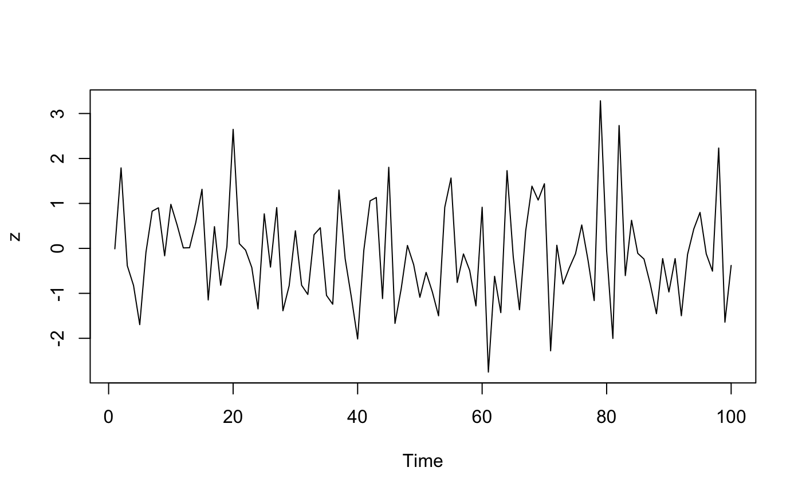

<!-- README.md is generated from README.Rmd. Please edit that file -->

# magrittr <a href='https:/magrittr.tidyverse.org'></a>

<!-- badges: start -->

[](https://cran.r-project.org/package=magrittr)
[](https://codecov.io/gh/tidyverse/magrittr?branch=master)
[](https://github.com/tidyverse/magrittr/actions)
<!-- badges: end -->

## Overview

The magrittr package offers a set of operators which make your code more
readable by:

  - structuring sequences of data operations left-to-right (as opposed
    to from the inside and out),
  - avoiding nested function calls,
  - minimizing the need for local variables and function definitions,
    and
  - making it easy to add steps anywhere in the sequence of operations.

The operators pipe their left-hand side values forward into expressions
that appear on the right-hand side, i.e. one can replace `f(x)` with `x
%>% f()`, where `%>%` is the (main) pipe-operator. When coupling several
function calls with the pipe-operator, the benefit will become more
apparent. Consider this pseudo example:

``` r
the_data <-
  read.csv('/path/to/data/file.csv') %>%
  subset(variable_a > x) %>%
  transform(variable_c = variable_a/variable_b) %>%
  head(100)
```

Four operations are performed to arrive at the desired data set, and
they are written in a natural order: the same as the order of execution.
Also, no temporary variables are needed. If yet another operation is
required, it is straightforward to add to the sequence of operations
wherever it may be needed.

If you are new to magrittr, the best place to start is the [pipes
chapter](https://r4ds.had.co.nz/pipes.html) in R for data science.

## Installation

``` r
# The easiest way to get magrittr is to install the whole tidyverse:
install.packages("tidyverse")

# Alternatively, install just magrittr:
install.packages("magrittr")

# Or the development version from GitHub:
# install.packages("devtools")
devtools::install_github("tidyverse/magrittr")
```

## Usage

### Basic piping

  - `x %>% f` is equivalent to `f(x)`
  - `x %>% f(y)` is equivalent to `f(x, y)`
  - `x %>% f %>% g %>% h` is equivalent to `h(g(f(x)))`

Here, “equivalent” is not technically exact: evaluation is non-standard,
and the left-hand side is evaluated before passed on to the right-hand
side expression. However, in most cases this has no practical
implication.

### The argument placeholder

  - `x %>% f(y, .)` is equivalent to `f(y, x)`
  - `x %>% f(y, z = .)` is equivalent to `f(y, z = x)`

### Re-using the placeholder for attributes

It is straightforward to use the placeholder several times in a
right-hand side expression. However, when the placeholder only appears
in a nested expressions magrittr will still apply the first-argument
rule. The reason is that in most cases this results more clean code.

`x %>% f(y = nrow(.), z = ncol(.))` is equivalent to `f(x, y = nrow(x),
z = ncol(x))`

The behavior can be overruled by enclosing the right-hand side in
braces:

`x %>% {f(y = nrow(.), z = ncol(.))}` is equivalent to `f(y = nrow(x), z
= ncol(x))`

### Building (unary) functions

Any pipeline starting with the `.` will return a function which can
later be used to apply the pipeline to values. Building functions in
magrittr is therefore similar to building other values.

``` r
f <- . %>% cos %>% sin 
# is equivalent to 
f <- function(.) sin(cos(.)) 
```

### Pipe with exposition of variables

Many functions accept a data argument, e.g. `lm` and `aggregate`, which
is very useful in a pipeline where data is first processed and then
passed into such a function. There are also functions that do not have a
data argument, for which it is useful to expose the variables in the
data. This is done with the `%$%` operator:

``` r
iris %>%
  subset(Sepal.Length > mean(Sepal.Length)) %$%
  cor(Sepal.Length, Sepal.Width)
#> [1] 0.3361992

data.frame(z = rnorm(100)) %$%
  ts.plot(z)
```

<!-- -->

## Code of Conduct

Please note that the magrittr project is released with a [Contributor
Code of Conduct](https://magrittr.tidyverse.org/CODE_OF_CONDUCT.html).
By contributing to this project, you agree to abide by its terms.
